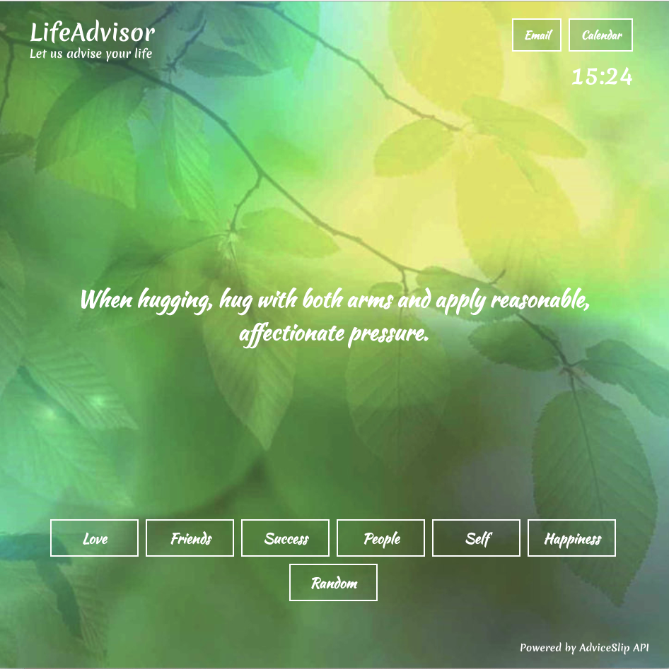

# LIFEADVISOR

### DESCRIPTION

A webapp designed to deliver advice from the AdviceSlip API the user. Users may view advice across a variety of categories or receive random advice.

---

### BRIEF EXAMPLE

A screenshot of the app. Users may click on the categories at the bottom of the screen to change the advice that is displayed.

---

### CURRENT FEATURES

-Users may click on a category button and receive advice from a category.

-Users may click on a button and receive random advice from all categories.

-Users may view the time.

-Users may click the "Email" and "Calendar" links to visit Gmail and Google Calendar.

### PLANNED FEATURES

1. The ability to save advice
2. The ability to remove advice 'slips' from category arrays so that duplicate slips are not shown.
3. Full integration with Gmail and Calendar APIs to show unread message notifications.

---

### LIST OF TECHNOLOGIES USED

- HTML
- CSS
- JavaScript
- React.js

---

### CONTRIBUTION GUIDELINES

- [Source Code](https://github.com/bguayante/SEIR-Project2)

- [Issues](https://github.com/bguayante/SEIR-Project2/issues)
