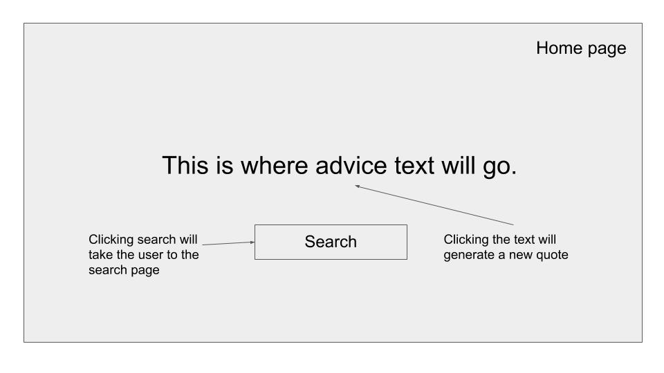
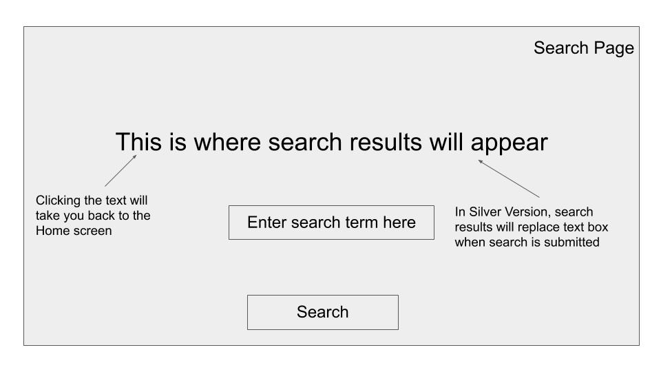
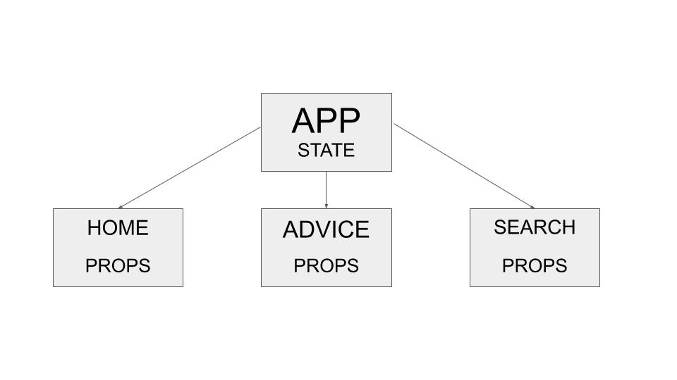

# LifeAdvisor

---

### Project Description

---

**LifeAdvisor** is a web app that provides advice to the user upon clicking a button. Users may also search for advice on specific topics by using keywords.

---

### Wireframes

---

##### Home Page



##### Search Page



---

### MVP User Stories

- As a user, I want to see advice that is the product of an API fetch request.

- As a user, I want to search for advice that is the product of interpolation of my input and the API URL.

- As a user, I want to experience the app as a single site, but want the functionality of being able to switch between information on different pages using React Router.

#### Silver User Stories

- As a user, I want the search bar to be replaced by text when I submit a search so that my advice appears the same on both pages for a more seamless experience.

---

### API

---

###### Documentation

https://api.adviceslip.com/

###### Sample Response

```{
slip:
{
advice: "Enjoy a little nonsense now and then.",
slip_id: "160"
}
}
```

---

### Component Hierarchy

---


